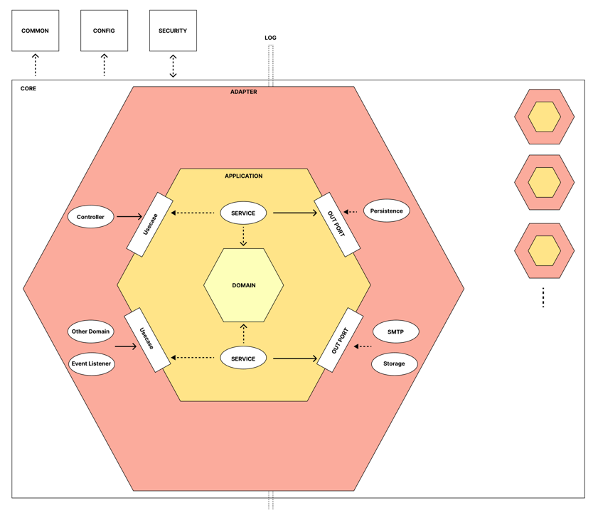
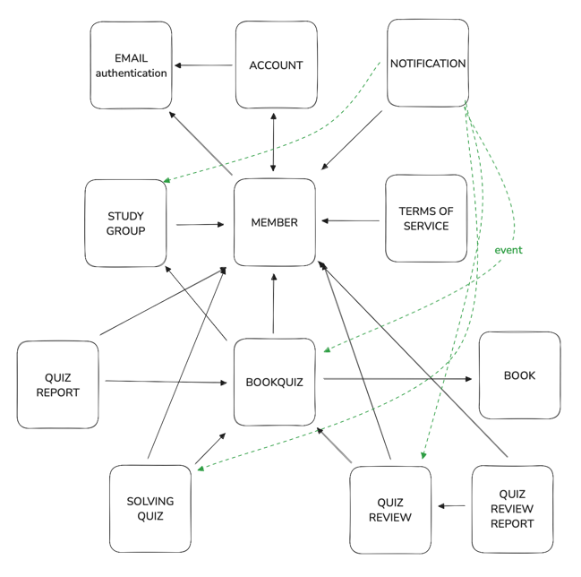
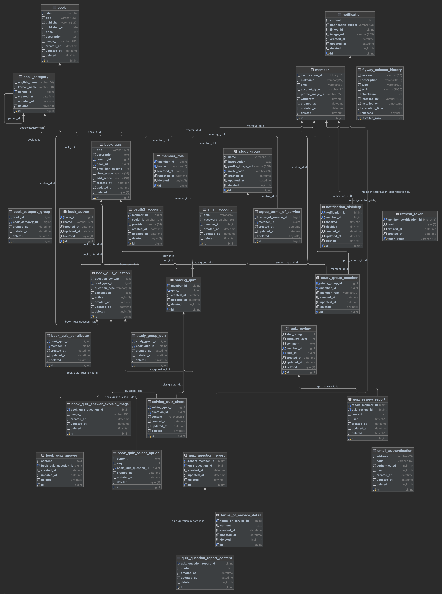

# 📚똑바로 읽었는지 DOKBARO가 확인해 드릴게요.

---

### 자기 계발과 성장을 위해 독서를 활용하는 **개발자들을 위한 퀴즈 학습 플랫폼, DOKBARO**입니다.

개발 서적을 즐겨 읽지만, **매번 내용을 제대로 이해했는지 확인하기 어렵지 않으셨나요?** 혹은 이해 부족으로 인해 **독서 스터디가 소수만 적극적으로 참여하는 형태로 변질되는 경험**을 하셨을지도 모릅니다.

우리는 이러한 문제점에서 시작해 퀴즈를 통해 **독서의 핵심 내용**을 더욱 효과적으로 **이해**하고, 나아가 스터디원 모두가 참여하며 성장할 수 있는 환경을 제공하기 위해 서비스를 기획했습니다.

## 📕Main Service

1. 도서를 선택해 **전체 공개용 퀴즈를 출제하고 풀어볼** 수 있어요.
2. 스터디 맞춤용 퀴즈로 **함께 퀴즈에 참여하고, 스터디원들의 학습 현황 및 피드백을 확인**할 수 있어요.
  
 | **기능** | **설명** |
   | --- | --- |
   | SNS 가입/로그인 | 카카오톡,네이버,구글,깃허브 계정을 연동해 가입 및 로그인 |
   | 이메일 가입/로그인 | 이외 이메일 계정을 사용해 가입 및 로그인 |
   | 메인화면 | 도서 카테고리, 퀴즈 출제 및 풀이 접근 |
   | 도서 카테고리 | 여러 분야의 개발 서적 확인 |
   | 퀴즈 출제/풀이 | 하나의 개발 서적을 선택해 퀴즈 출제 및 풀이 |
   | 마이페이지 | 개인 별 퀴즈 참여 기록 확인 및 관리 |
   | 스터디 그룹 | 스터디 그룹 별 퀴즈 관리 및 그룹원 별 학습 현황 확인 |
   | 퀴즈 후기 | 퀴즈 별 별점 및 텍스트 후기 작성 및 확인 |

# 인프라 구조

# 사용 기술

# 아키텍처

# 컴포넌트 구조

# ER Diagram

# 배포 파이프라인

# blog

